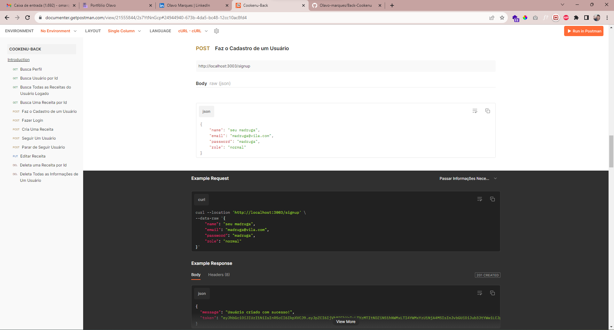
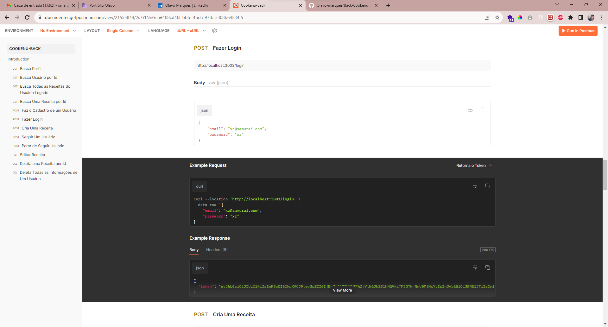
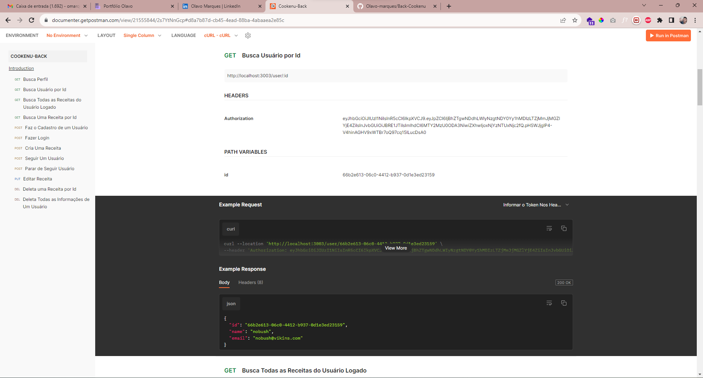
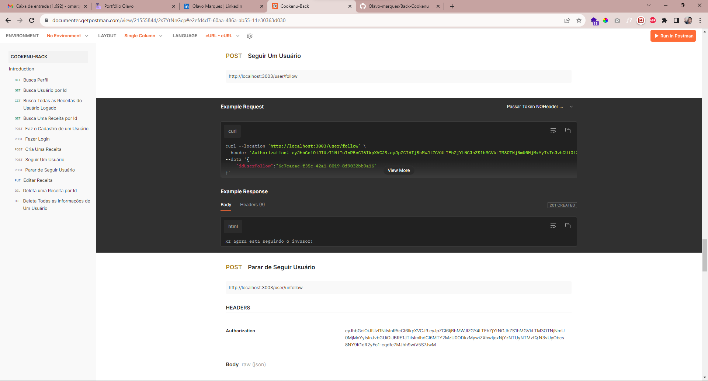
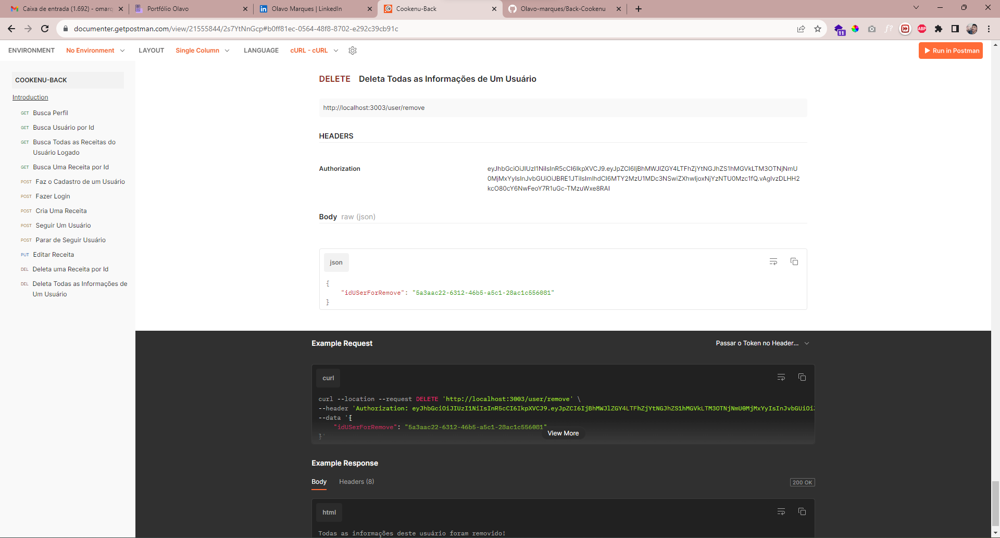
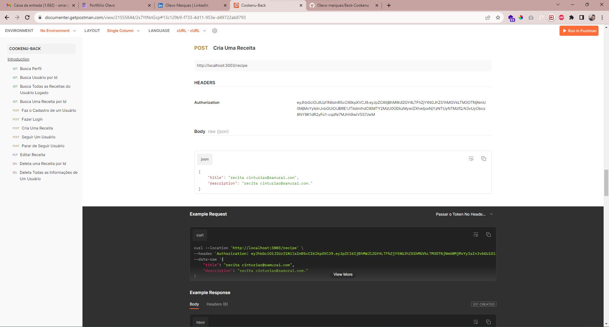
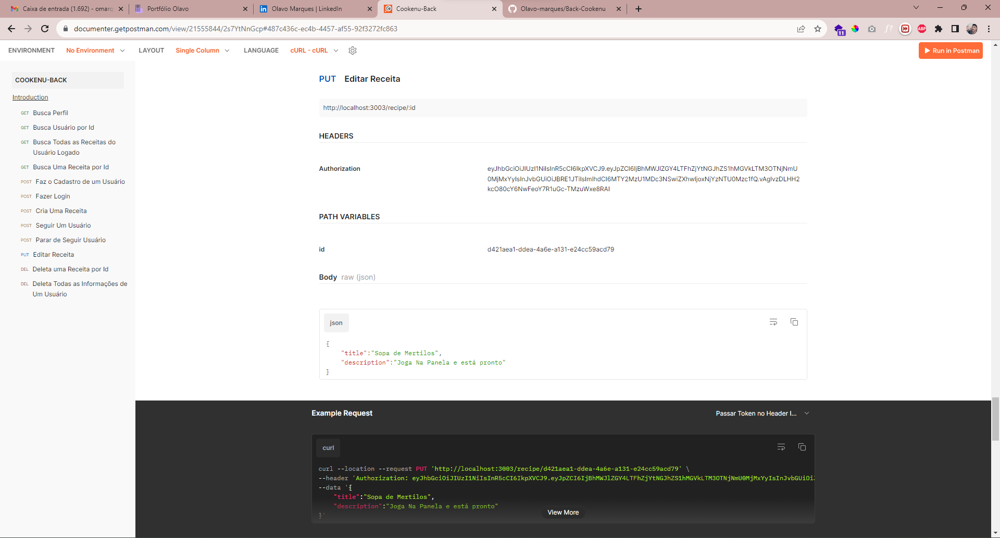
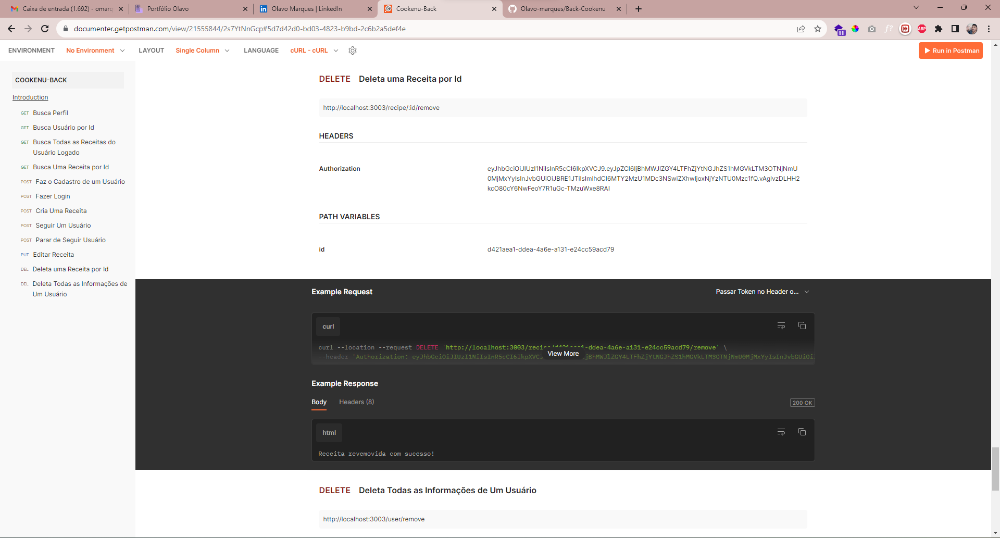
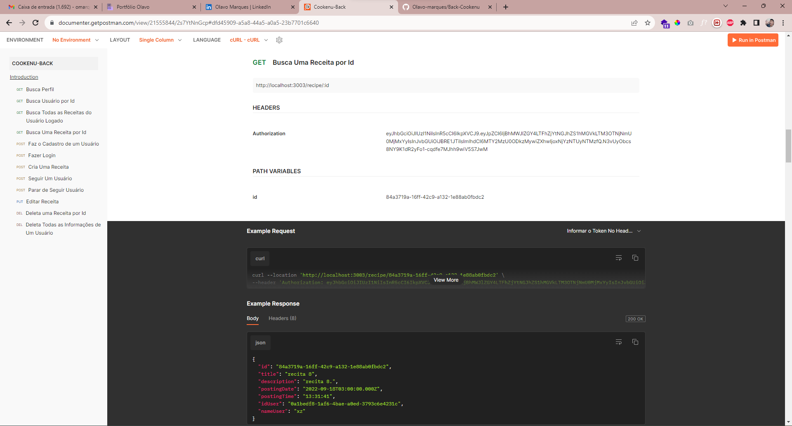

# Nome do Projeto

Cookenu-Back

### Link Documentação

[Documentação](https://documenter.getpostman.com/view/21555844/2s7YtNnGcp)

### Descrição
O objetivo do projeto foi a criar uma api para um site de recita, onde é possível fazer as seguintes requisições:

- Fazer cadastro
- Fazer login
- Buscar perfil
- Buscar usuário por id
- Ver todas as receitas do usuário logado
- Seguir um usuário
- Parar de seguir um usuário
- Deletar todas as imformações de um usuário
- Criar uma receita
- Editar uma receita
- Buiscar receita por id
- Deletar uma receita por id

##### Mais informações sobre as requisições ver [Documentação](https://documenter.getpostman.com/view/21555844/2s7YtNnGcp)

### Cadastro

### Login

### Buscar Perfil

### Buscar Usuário Por Id

### Seguir Usuário

### Parar de Seguir Usuário

### Deletar Usuário

### Criar Receitas

### Editar Receitas

### Deletar receitas

### Buscar Receitas Por Id

                                    
O objetivo do projeto foi a criação de uma api para site de recita, onde é possível criar usuário, login, ver perfil, criar receita e muitos outras endpoints confira todos na documentação acima.

### Como Rodar o projeto

[Abrir Projeto no GitHub](https://github.com/future4code/alves-Olavo-Nascimento/pull/66)

- Faça um clone do projeto a partir do link acima

- Abra esse arquivo com Visual Studio Code

- **npm i** para instalar os pacotes necessários

- **npm run dev** para rodar o projeto servidor local

 

>Autor: Olavo marques do nascimento

### GitHub

<https://github.com/Olavo-marques>

### LinkedIn

[Perfil LinkedIn](https://www.linkedin.com/in/olavo-marques-6421ab123)
